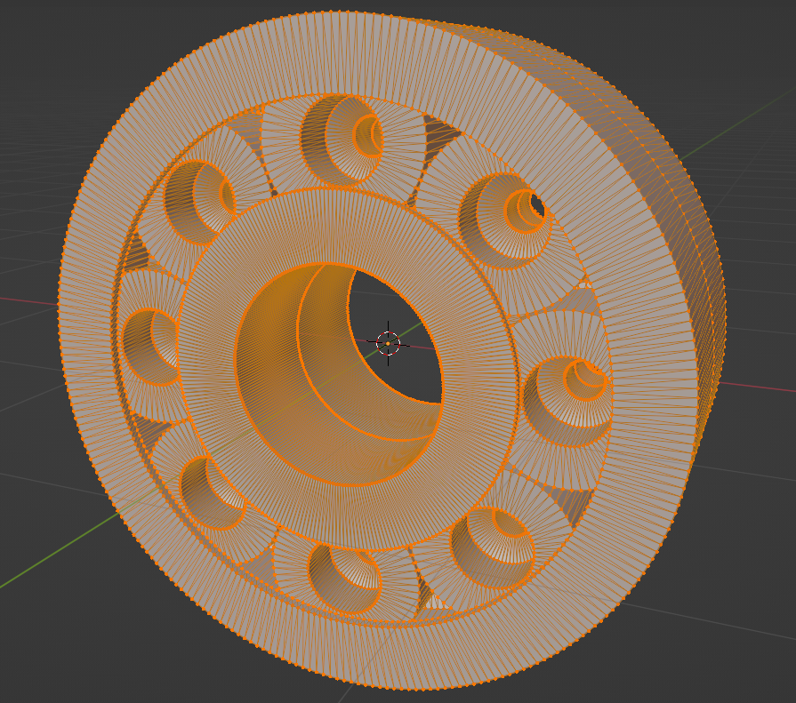

# Wavefront bearing generator

##### Requires only gcc

## Dimensions

##### Epsilon in x-axis and y-axis - additional space between faces in x-axis and y-axis
##### Epsilon in z-axis - additional space between faces in z-axis

###### View in z-axis direction

###### The intersection

###### View in y-axis direction

## Images

###### Example bearing

###### Bearing skeleton

###### Large bearing

###### Bearing with roll liner = 1

###### Bearing with roll cover = 0

###### View on rail of roll

###### Skeletal side view 

