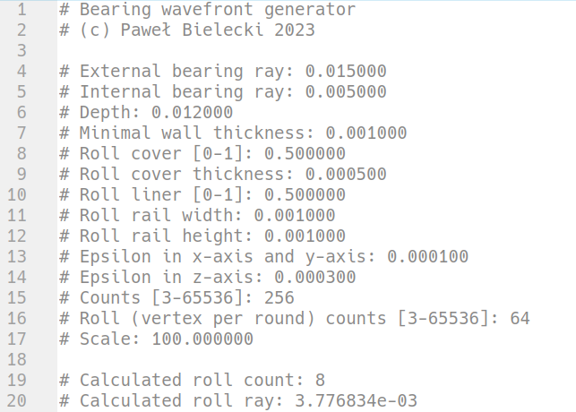

# Wavefront (and stl) bearing generator

## Usage

Requires only gcc.

Compile and process examples with command:
```
make all
```

The program reads data from standard input and prints models to standard output (wavefront) and standard error (stl).

Usage:
```
# Print only one format
./bin/wf obj < examples/def.in > models/def.obj 
./bin/wf stl < examples/def.in 2> models/def.stl

# Print wavefront and stl but save only one
./bin/wf < examples/def.in > models/def.obj 2> /dev/null
./bin/wf < examples/def.in 2> models/def.stl > /dev/null

# Print wavefront and stl and save them all
./bin/wf < examples/def.in > models/def.obj 2> models/def.stl
./bin/wf < examples/def.in obj stl > models/def.obj 2> models/def.stl
```


See the `examples` for the input format.

Below is the order of the input data:<br>

<br>`Calculated roll count` and `Calculated roll ray` are generated automatically.


## Dimensions

Count - verticles per round
Roll (vertex per round) count - verticles per round (in rolls)
Epsilon in x-axis and y-axis - additional space between faces in x-axis and y-axis <br>
Epsilon in z-axis - additional space between faces in z-axis


<br><br>View in z-axis direction<br>


<br><br>The intersection<br>


<br><br>View in y-axis direction<br>


## Images

<br><br>Example bearing<br>


<br><br>Bearing skeleton<br>


<br><br>Large bearing<br>


<br><br>Bearing with roll liner = 1<br>


<br><br>Bearing with roll cover = 0<br>


<br><br>View on rail of roll<br>


<br><br>Skeletal side view<br>


## Practical usage

Adjust the epsilon depending on the accuracy of your printer.
Too small causes the rollers to stick to the rings.
Remember to add support.
Adding support causes additional bearing sticking and problems on first start.
If the rails are set too large, the rollers may be cut.


